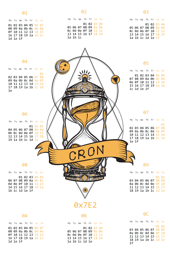
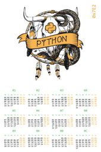
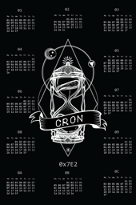
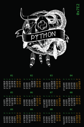
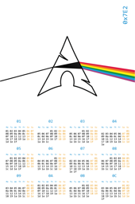
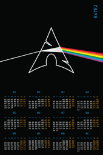
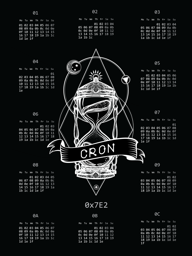
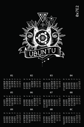
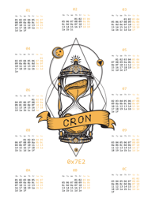
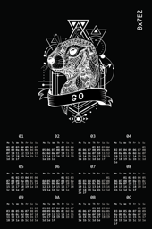

|  |  |  |  |
| :---: | :---: | :---: | :---: |
|  |  |  |  |
| [hexadecimal linux 2018 white](calendars/2018/eu/hexadecimal-linux-2018-white.png) | [hexadecimal python 2018 eu white](calendars/2018/eu/hexadecimal-python-2018-eu-white.png) | [hexadecimal linux 2018 black](calendars/2018/eu/hexadecimal-linux-2018-black.png) | [hexadecimal python 2018 eu black](calendars/2018/eu/hexadecimal-python-2018-eu-black.png) |
|  |  |  |  |
| [hexadecimal arch 2018 eu white](calendars/2018/eu/hexadecimal-arch-2018-eu-white.png) | [hexadecimal arch 2018 eu](calendars/2018/eu/hexadecimal-arch-2018-eu.png) | [hexadecimal linux 2018 black 18 by 24](calendars/2018/eu/hexadecimal-linux-2018-black-18-by-24.png) | [hexadecimal ubuntu eu dark](calendars/2018/eu/hexadecimal-ubuntu-eu-dark.png) |
|  |  |
| [hexadecimal linux 2018 white 18 by 24](calendars/2018/eu/hexadecimal-linux-2018-white-18-by-24.png) | [hexadecimal go eu dark](calendars/2018/eu/hexadecimal-go-eu-dark.png) |
