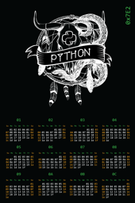
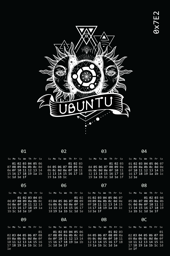
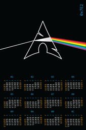
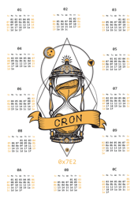
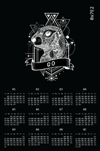
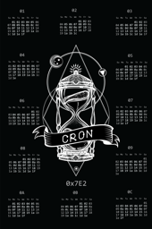
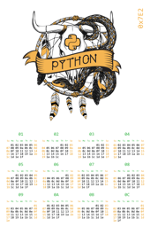

|  |  |  |  |
| :---: | :---: | :---: | :---: |
|  |  |  |  |
| [hexadecimal python 2018 us black](calendars/2018/us/hexadecimal-python-2018-us-black.png) | [hexadecimal ubuntu us dark](calendars/2018/us/hexadecimal-ubuntu-us-dark.png) | [hexadecimal arch 2018 us](calendars/2018/us/hexadecimal-arch-2018-us.png) | [hexadecimal cron us white](calendars/2018/us/hexadecimal-cron-us-white.png) |
|  |  |  |
| [hexadecimal go us dark](calendars/2018/us/hexadecimal-go-us-dark.png) | [hexadecimal cron us black](calendars/2018/us/hexadecimal-cron-us-black.png) | [hexadecimal python 2018 us white](calendars/2018/us/hexadecimal-python-2018-us-white.png) |
