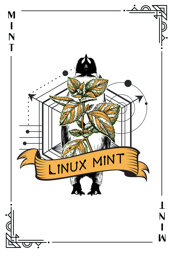
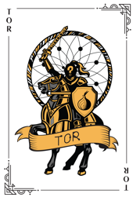
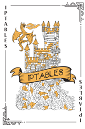
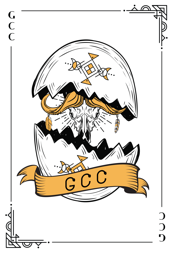
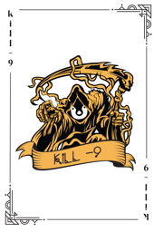
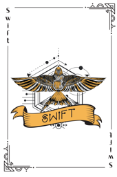
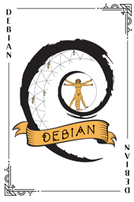
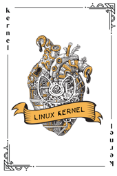

|  |  |  |  |
| :---: | :---: | :---: | :---: |
|  |  |  |  |
| [mint card](cards/classic/mint-card.png) | [ubuntu card](cards/classic/ubuntu-card.png) | [arch card](cards/classic/arch-card.png) | [tor card](cards/classic/tor-card.png) |
|  |  |  |  |
| [gnu card](cards/classic/gnu-card.png) | [manjaro card](cards/classic/manjaro-card.png) | [solus card](cards/classic/solus-card.png) | [python card](cards/classic/python-card.png) |
|  |  |  |  |
| [linuxmasterrace card](cards/classic/linuxmasterrace-card.png) | [php card](cards/classic/php-card.png) | [golang card](cards/classic/golang-card.png) | [gnu linux card](cards/classic/gnu-linux-card.png) |
|  |  |  |  |
| [vim card](cards/classic/vim-card.png) | [sudo card](cards/classic/sudo-card.png) | [java card](cards/classic/java-card.png) | [iptables card](cards/classic/iptables-card.png) |
|  |  |  |  |
| [gcc card](cards/classic/gcc-card.png) | [arch card blue](cards/classic/arch-card-blue.png) | [userdel card](cards/classic/userdel-card.png) | [cron card](cards/classic/cron-card.png) |
|  |  |  |  |
| [kill card](cards/classic/kill-card.png) | [swift card](cards/classic/swift-card.png) | [fedora card](cards/classic/fedora-card.png) | [debian card](cards/classic/debian-card.png) |
|  |  |  |  |
| [su card](cards/classic/su-card.png) | [freebsd card](cards/classic/freebsd-card.png) | [kali card](cards/classic/kali-card.png) | [kernel card](cards/classic/kernel-card.png) |
|  |
| [root card](cards/classic/root-card.png) |
