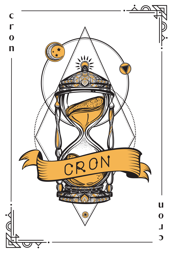
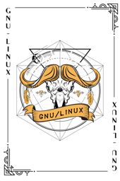
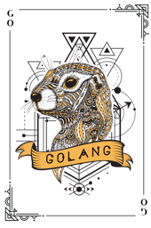
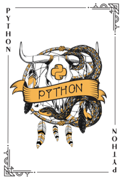
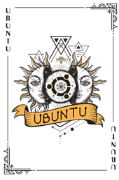
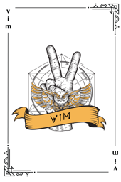

|  |  |  |  |
| :---: | :---: | :---: | :---: |
|  |  |  |  |
| [arch card blue](arch-card-blue.png) | [arch card](arch-card.png) | [cron card](cron-card.png) | [debian card](debian-card.png) |
|  |  |  |  |
| [fedora card](fedora-card.png) | [freebsd card](freebsd-card.png) | [gcc card](gcc-card.png) | [gnu card](gnu-card.png) |
|  |  |  |  |
| [gnu linux card](gnu-linux-card.png) | [golang card](golang-card.png) | [iptables card](iptables-card.png) | [java card](java-card.png) |
|  |  |  |  |
| [kali card](kali-card.png) | [kernel card](kernel-card.png) | [kill card](kill-card.png) | [linuxmasterrace card](linuxmasterrace-card.png) |
|  |  |  |  |
| [manjaro card](manjaro-card.png) | [mint card](mint-card.png) | [php card](php-card.png) | [python card](python-card.png) |
|  |  |  |  |
| [root card](root-card.png) | [solus card](solus-card.png) | [su card](su-card.png) | [sudo card](sudo-card.png) |
|  |  |  |  |
| [swift card](swift-card.png) | [tor card](tor-card.png) | [ubuntu card](ubuntu-card.png) | [userdel card](userdel-card.png) |
|  |
| [vim card](vim-card.png) |
