|  |  |  |  |
| :---: | :---: | :---: | :---: |
| 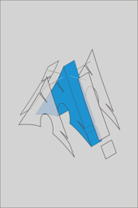 |  | 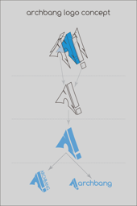 | 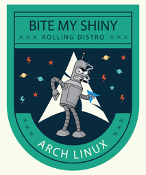 |
| [arch anatomy](arch-anatomy.png) | [arch badge](arch-badge.png) | [arch bang](arch-bang.png) | [arch bite](arch-bite.png) |
|  | 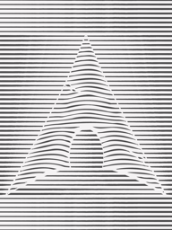 |  |  |
| [arch formula](arch-formula.png) | [arch lines](arch-lines.png) | [arch linux n1](arch-linux-n1.png) | [arch obey](arch-obey.png) |
|  |  | 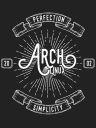 |  |
| [arch patrick](arch-patrick.png) | [arch tux](arch-tux.png) | [arch vintage](arch-vintage.png) | [arch wanted](arch-wanted.png) |
| 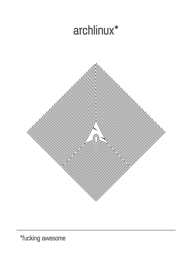 |  | 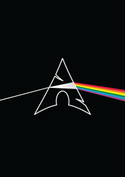 | 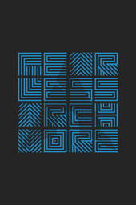 |
| [archlinux fucking awesome](archlinux-fucking-awesome.png) | [clap your hands](clap-your-hands.png) | [dakr side of arch](dakr-side-of-arch.png) | [fearless](fearless.png) |
| 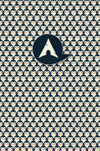 |  | 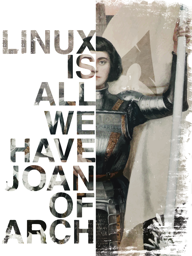 | 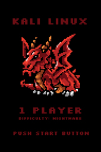 |
| [identify arch](identify-arch.png) | [in arch we trust](in-arch-we-trust.png) | [joan of arch](joan-of-arch.png) | [kali play](kali-play.png) |
