|  |  |  |  |
| :---: | :---: | :---: | :---: |
| 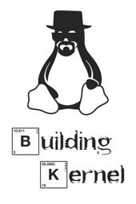 |  | 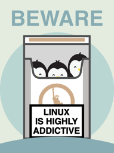 |  |
| [building kernel](non-distro/building-kernel.png) | [gnu skull](non-distro/gnu-skull.png) | [linux is addictive](non-distro/linux-is-addictive.png) | [kernelmom](non-distro/kernelmom.png) |
|  | 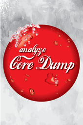 |  |  |
| [pulp linux censored](non-distro/pulp-linux-censored.png) | [core dump](non-distro/core-dump.png) | [im root](non-distro/im-root.png) | [linux friends](non-distro/linux-friends.png) |
| 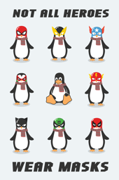 | 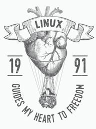 |  |  |
| [supertux](non-distro/supertux.png) | [linux guides me](non-distro/linux-guides-me.png) | [linux penguins](non-distro/linux-penguins.png) | [linux n1](non-distro/linux-n1.png) |
|  |  | 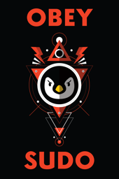 | 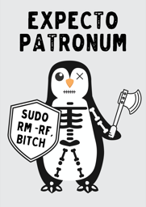 |
| [linux is the key](non-distro/linux-is-the-key.png) | [germany linux](non-distro/germany-linux.png) | [sudo red](non-distro/sudo-red.png) | [expecto tux](non-distro/expecto-tux.png) |
|  |  | 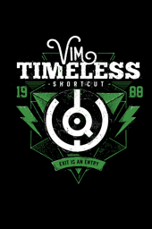 |  |
| [tux sudo](non-distro/tux-sudo.png) | [tux king](non-distro/tux-king.png) | [vim shortcut](non-distro/vim-shortcut.png) | [githubopen](non-distro/githubopen.png) |
| 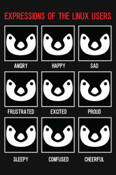 |  | 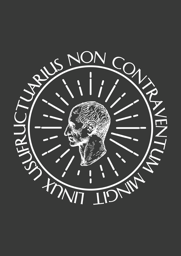 | 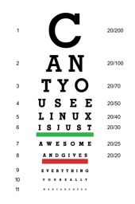 |
| [emotions of linux](non-distro/emotions-of-linux.png) | [linux user](non-distro/linux-user.png) | [usufructuarius](non-distro/usufructuarius.png) | [eye chart](non-distro/eye-chart.png) |
|  |  | 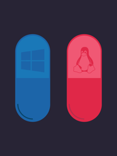 | 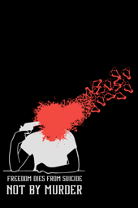 |
| [gitpornhub](non-distro/gitpornhub.png) | [respect linux](non-distro/respect-linux.png) | [redpill](non-distro/redpill.png) | [freedomsuicide](non-distro/freedomsuicide.png) |
| 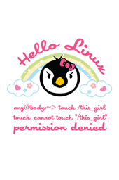 |  | 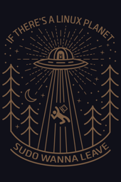 |  |
| [hello linux](non-distro/hello-linux.png) | [linux lines](non-distro/linux-lines.png) | [i want to leave](non-distro/i-want-to-leave.png) | [liberty](non-distro/liberty.png) |
|  | 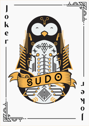 | 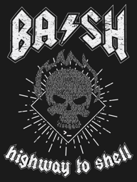 |  |
| [tuxadarity](non-distro/tuxadarity.png) | [joker poster](non-distro/joker-poster.png) | [bash highway to shell v2](non-distro/bash-highway-to-shell-v2.png) | [linux fire](non-distro/linux-fire.png) |
|  |  |  |  |
| [ddrandom](non-distro/ddrandom.png) | [linux wave](non-distro/linux-wave.png) | [linuxbrains](non-distro/linuxbrains.png) | [nutshell](non-distro/nutshell.png) |
| 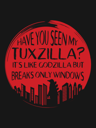 |  | 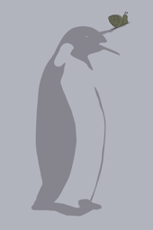 |  |
| [have you seen my tuxzilla](non-distro/have-you-seen-my-tuxzilla.png) | [big brother](non-distro/big-brother.png) | [snail tux](non-distro/snail-tux.png) | [australian linux brotherhood](non-distro/australian-linux-brotherhood.png) |
|  |  |  | 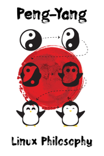 |
| [why so windows](non-distro/why-so-windows.png) | [linux rocks](non-distro/linux-rocks.png) | [falcon heavy](non-distro/falcon-heavy.png) | [peng yang](non-distro/peng-yang.png) |
|  |  |  |  |
| [lack of linux](non-distro/lack-of-linux.png) | [i love linux](non-distro/i-love-linux.png) | [change persmissions](non-distro/change-persmissions.png) | [tux in my dna](non-distro/tux-in-my-dna.png) |
| 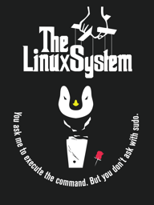 |  |  |  |
| [godfather tux](non-distro/godfather-tux.png) | [cosmotux](non-distro/cosmotux.png) | [in wget we trust](non-distro/in-wget-we-trust.png) | [dotfiles](non-distro/dotfiles.png) |
|  | 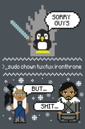 | 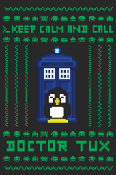 | 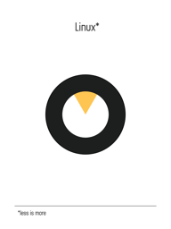 |
| [no gui](non-distro/no-gui.png) | [ironthrone](non-distro/ironthrone.png) | [doctor tux](non-distro/doctor-tux.png) | [less is more](non-distro/less-is-more.png) |
|  | 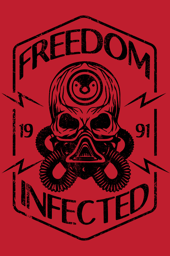 | 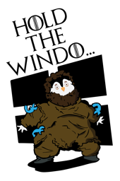 | 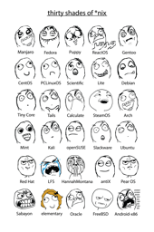 |
| [umbrella](non-distro/umbrella.png) | [linux infected](non-distro/linux-infected.png) | [hold the windows](non-distro/hold-the-windows.png) | [thirty shades](non-distro/thirty-shades.png) |
|  |  | 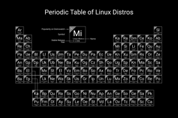 | 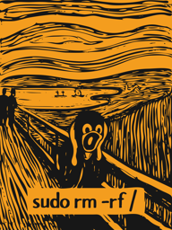 |
| [ulimit poster](non-distro/ulimit-poster.png) | [may the foss be with you](non-distro/may-the-foss-be-with-you.png) | [periodic table black](non-distro/periodic-table-black.png) | [scream](non-distro/scream.png) |
| 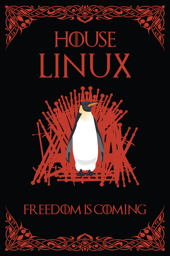 | 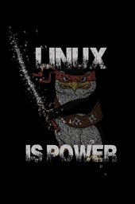 |  |  |
| [freedom is coming](non-distro/freedom-is-coming.png) | [linux is power](non-distro/linux-is-power.png) | [linux is coming](non-distro/linux-is-coming.png) | [my safeword](non-distro/my-safeword.png) |
|  |  | 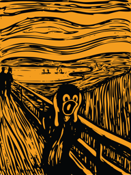 | 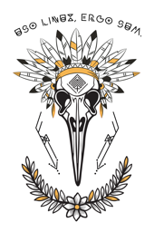 |
| [live free and prosper](non-distro/live-free-and-prosper.png) | [be good](non-distro/be-good.png) | [scream notext](non-distro/scream-notext.png) | [penguin skull](non-distro/penguin-skull.png) |
| 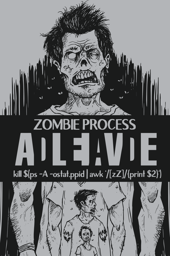 | 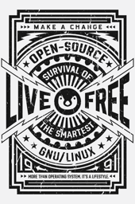 | 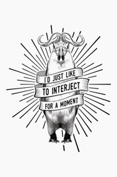 | 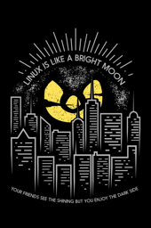 |
| [zombie process](non-distro/zombie-process.png) | [live free](non-distro/live-free.png) | [interject](non-distro/interject.png) | [linux moon](non-distro/linux-moon.png) |
| 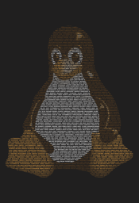 |  | 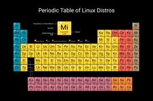 | 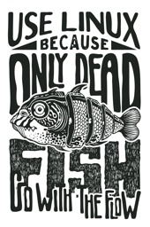 |
| [tux text](non-distro/tux-text.png) | [pulp linux](non-distro/pulp-linux.png) | [periodic table color](non-distro/periodic-table-color.png) | [dead fish](non-distro/dead-fish.png) |
|  | 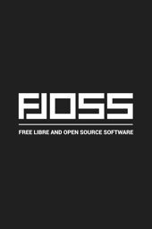 |  |
| [may the floss](non-distro/may-the-floss.png) | [own boss](non-distro/own-boss.png) | [thou shalt not kill](non-distro/thou-shalt-not-kill.png) |
