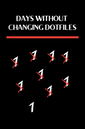
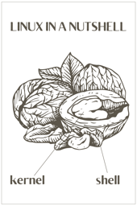

|  |  |  |  |
| :---: | :---: | :---: | :---: |
|  |  |  |  |
| [australian linux brotherhood](australian-linux-brotherhood.png) | [bash highway to shell v2](bash-highway-to-shell-v2.png) | [be good](be-good.png) | [big brother](big-brother.png) |
|  |  |  |  |
| [building kernel](building-kernel.png) | [change persmissions](change-persmissions.png) | [core dump](core-dump.png) | [cosmotux](cosmotux.png) |
|  |  |  |  |
| [ddrandom](ddrandom.png) | [dead fish](dead-fish.png) | [doctor tux](doctor-tux.png) | [dotfiles](dotfiles.png) |
|  |  |  |  |
| [emotions of linux](emotions-of-linux.png) | [expecto tux](expecto-tux.png) | [eye chart](eye-chart.png) | [falcon heavy](falcon-heavy.png) |
|  |  |  |  |
| [freedom is coming](freedom-is-coming.png) | [freedomsuicide](freedomsuicide.png) | [germany linux](germany-linux.png) | [githubopen](githubopen.png) |
|  |  |  |  |
| [gitpornhub](gitpornhub.png) | [gnu skull](gnu-skull.png) | [godfather tux](godfather-tux.png) | [have you seen my tuxzilla](have-you-seen-my-tuxzilla.png) |
|  |  |  |  |
| [hello linux](hello-linux.png) | [hold the windows](hold-the-windows.png) | [i love linux](i-love-linux.png) | [i want to leave](i-want-to-leave.png) |
|  |  |  |  |
| [im root](im-root.png) | [in wget we trust](in-wget-we-trust.png) | [interject](interject.png) | [ironthrone](ironthrone.png) |
|  |  |  |  |
| [joker poster](joker-poster.png) | [kernelmom](kernelmom.png) | [lack of linux](lack-of-linux.png) | [less is more](less-is-more.png) |
|  |  |  |  |
| [liberty](liberty.png) | [linux fire](linux-fire.png) | [linux friends](linux-friends.png) | [linux guides me](linux-guides-me.png) |
|  |  |  |  |
| [linux infected](linux-infected.png) | [linux is addictive](linux-is-addictive.png) | [linux is coming](linux-is-coming.png) | [linux is power](linux-is-power.png) |
|  |  |  |  |
| [linux is the key](linux-is-the-key.png) | [linux lines](linux-lines.png) | [linux moon](linux-moon.png) | [linux n1](linux-n1.png) |
|  |  |  |  |
| [linux penguins](linux-penguins.png) | [linux rocks](linux-rocks.png) | [linux user](linux-user.png) | [linux wave](linux-wave.png) |
|  |  |  |  |
| [linuxbrains](linuxbrains.png) | [live free and prosper](live-free-and-prosper.png) | [live free](live-free.png) | [may the floss](may-the-floss.png) |
|  |  |  |  |
| [may the foss be with you](may-the-foss-be-with-you.png) | [my safeword](my-safeword.png) | [no gui](no-gui.png) | [nutshell](nutshell.png) |
|  |  |  |  |
| [own boss](own-boss.png) | [peng yang](peng-yang.png) | [penguin skull](penguin-skull.png) | [periodic table black](periodic-table-black.png) |
|  |  |  |  |
| [periodic table color](periodic-table-color.png) | [pulp linux censored](pulp-linux-censored.png) | [pulp linux](pulp-linux.png) | [redpill](redpill.png) |
|  |  |  |  |
| [respect linux](respect-linux.png) | [scream notext](scream-notext.png) | [scream](scream.png) | [snail tux](snail-tux.png) |
|  |  |  |  |
| [sudo red](sudo-red.png) | [supertux](supertux.png) | [thirty shades](thirty-shades.png) | [thou shalt not kill](thou-shalt-not-kill.png) |
|  |  |  |  |
| [tux in my dna](tux-in-my-dna.png) | [tux king](tux-king.png) | [tux sudo](tux-sudo.png) | [tux text](tux-text.png) |
|  |  |  |  |
| [tuxadarity](tuxadarity.png) | [ulimit poster](ulimit-poster.png) | [umbrella](umbrella.png) | [usufructuarius](usufructuarius.png) |
|  |  |  |
| [vim shortcut](vim-shortcut.png) | [why so windows](why-so-windows.png) | [zombie process](zombie-process.png) |
